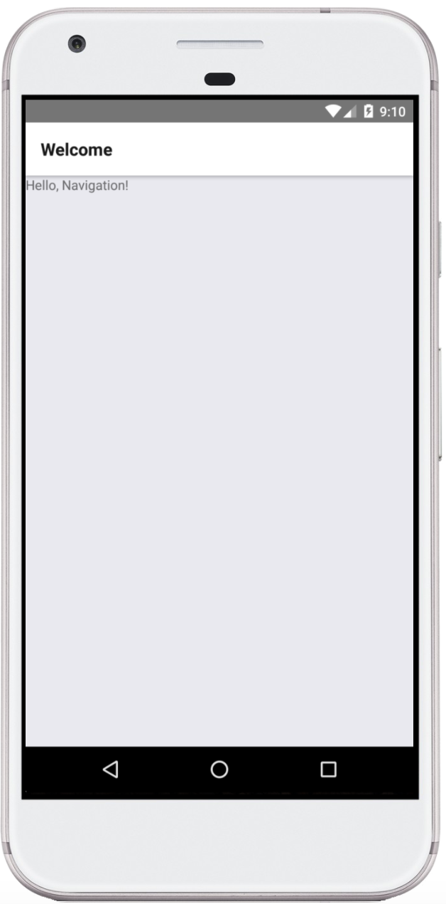
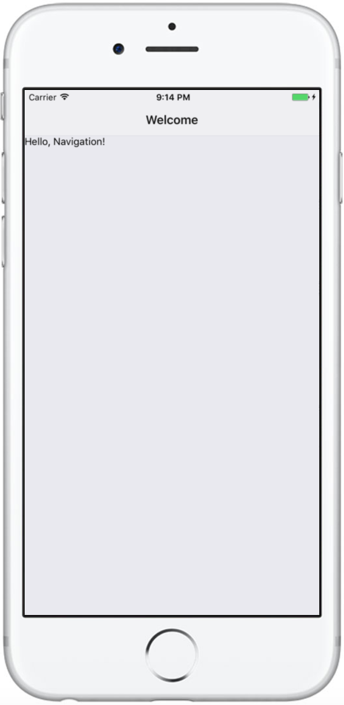

# Hello Mobile Navigation - 你好，手机导航！

让我们使用`React Navigation`为Android和iOS构建一个简单的聊天类应用程序。

## 设置和安装

首先，在开始之前，确保你已经设置好了[React Native](https://reactnative.cn/docs/0.51/getting-started.html#content)，接下来，创建一个新的项目，并添加`react-navigation`:

```shell
# Create a new React Native App
react-native init SimpleApp
cd SimpleApp

# Install the latest version of react-navigation from npm
npm install --save react-navigation

# Run the new app
react-native run-android
# or:
react-native run-ios
```

如果你使用的是`create-react-native-app`，而不是`react-native init`:
```shell
# Create a new React Native App
create-react-native-app SimpleApp
cd SimpleApp

# Install the latest version of react-navigation from npm
npm install --save react-navigation

# Run the new app
npm start

# This will start a development server for you and print a QR code in your terminal.
```

确认你能成功看到在iOS/Android上运行的示例应用程序：

<div align="center">
  
  
</div>

我们希望在iOS和Android上代码共享，所以删除`index.js`里的内容（如果你使用的是0.49之前的React Native，你需要删除`index.ios.js`和`index.android.js`里的内容），取而代之的是`import './App';`。此后，为了实现应用，需要创建新的文件`App.js`（如果你使用的是`create-react-native-app`命令创建的应用，这一步已经自动完成了）。

## 介绍`Stack Navigator`

我们打算在我们的app里使用`StackNavigator`，因为从概念上来说，我们想要获得一种“卡片式堆栈”的移动效果，也就是说把每个新的页面放到栈顶，返回时从栈顶移除。我们先从一个页面开始：
```javascript
import React from 'react';
import {
  AppRegistry,
  Text,
} from 'react-native';
import { StackNavigator } from 'react-navigation';

class HomeScreen extends React.Component {
  static navigationOptions = {
    title: 'Welcome',
  };
  render() {
    return <Text>Hello, Navigation!</Text>;
  }
}

export const SimpleApp = StackNavigator({
  Home: { screen: HomeScreen },
});

AppRegistry.registerComponent('SimpleApp', () => SimpleApp);
```

如果你是使用`create-react-native-app`命令创建的app，则自带的`App.js`文件将要被修改为：
```javascript
import React from 'react';
import { StyleSheet, Text, View } from 'react-native';
import { StackNavigator } from 'react-navigation';

class HomeScreen extends React.Component {
  static navigationOptions = {
    title: 'Welcome'
  };
  render() {
    return <Text>Hello, Navigation!</Text>;
  }
}

const SimpleApp = StackNavigator({
  Home: { screen: HomeScreen }
});

export default class App extends React.Component {
  render() {
    return <SimpleApp />;
  }
}

const styles = StyleSheet.create({
  container: {
    flex: 1,
    backgroundColor: '#fff',
    alignItems: 'center',
    justifyContent: 'center'
  }
});
```

界面的`title`是可以在静态对象`navigationOptions`中配置的，其中可以设置多个选项来配置导航器中页面的呈现方式。

现在iPhone和Android应用程序应该会显示相同的页面：

<div align="center">
    
       
</div>

## 添加一个新的页面


