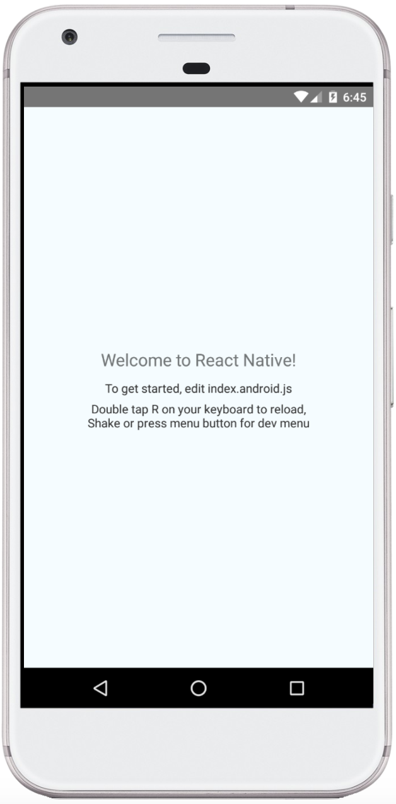
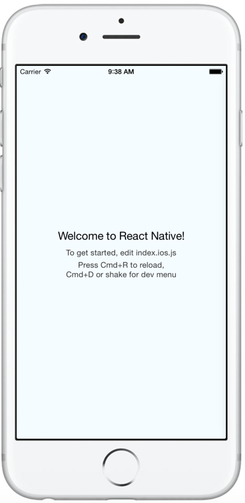

# Hello Mobile Navigation - 你好，手机导航！

让我们使用`React Navigation`为Android和iOS构建一个简单的聊天类应用程序。

## 设置和安装

首先，在开始之前，确保你已经设置好了[React Native](https://reactnative.cn/docs/0.51/getting-started.html#content)，接下来，创建一个新的项目，并添加`react-navigation`:

```shell
# Create a new React Native App
react-native init SimpleApp
cd SimpleApp

# Install the latest version of react-navigation from npm
npm install --save react-navigation

# Run the new app
react-native run-android
# or:
react-native run-ios
```

如果你使用的是`create-react-native-app`，而不是`react-native init`:
```shell
# Create a new React Native App
create-react-native-app SimpleApp
cd SimpleApp

# Install the latest version of react-navigation from npm
npm install --save react-navigation

# Run the new app
npm start

# This will start a development server for you and print a QR code in your terminal.
```

确认你能成功看到在iOS/Android上运行的示例应用程序：




